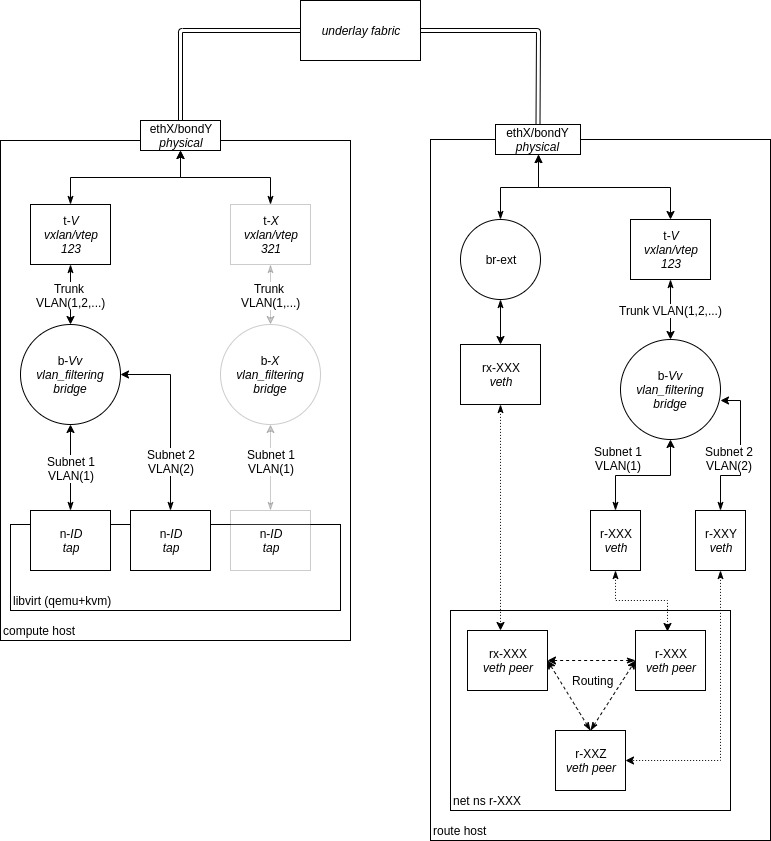

# VPC
Create simple VxLAN based VPC's written in (mostly) Go using Linux bridges/netlinks, iptables & network namespaces!

### Why?
For fun and to learn!

# Schematic

## Host Types
 - Compute hosts facilitate the creation and management of VM's or containers 
 - Route hosts provide virtual routers
 - Management hosts (not in diagram) provide management facilities such as BGP route reflection and configuration management. 

> There is no technical reason why a compute host can also be a route host and vice-versa. This simply provides better security, bandwidth and segregation of duties on hosts.

## Connectivity
Each VM, namespace or container is connected to a Linux bridge (with VLAN filtering enabled) on a compute host. Compute hosts are connected via Linux VxLAN devices (VTEPs).

## VTEP Learning
VxLAN learning is disabled by default. Learning is derived from an ML-BGP-L2VPN-EVPN client (via [frr](https://github.com/FRRouting/frr)) on each compute host and route reflectors on management hosts. 

## Segregation
Each 'tenant' is separated by VxLAN VNI's and each Subnet is protected via inner VLAN tagging on a Linux bridge per tenant. 

# Agents
## L2
The L2 agent provides a GRPC API to create bridges, VxLAN VTEPs and manage VLAN tagging on the bridges.

## L3
The L3 agent provides the functionality to create the virtual router namespaces and provide simple DHCP capabilities.

# Similar architectures
[Openstacks Neutron](https://wiki.openstack.org/wiki/Neutron) in Linux bridge mode.